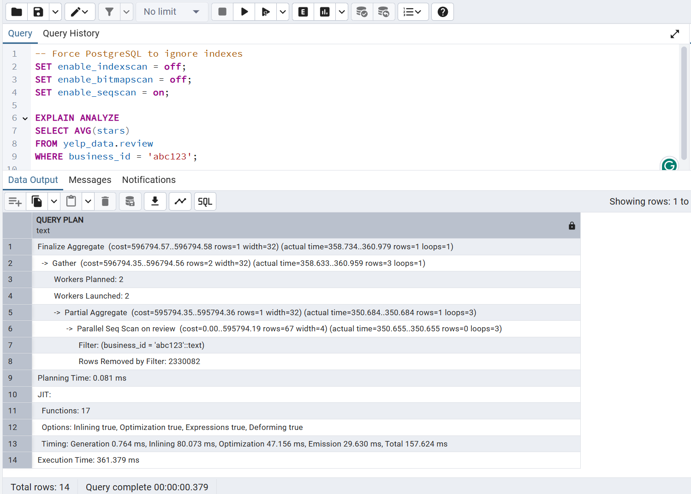
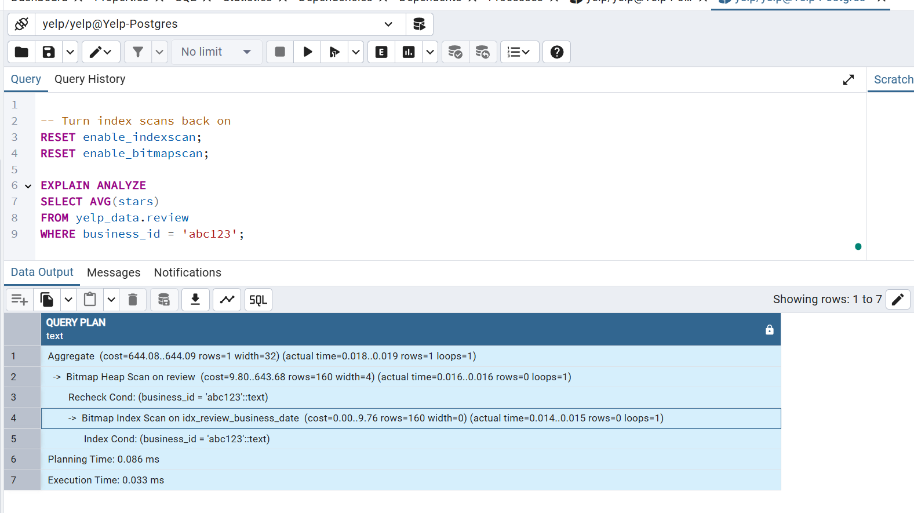
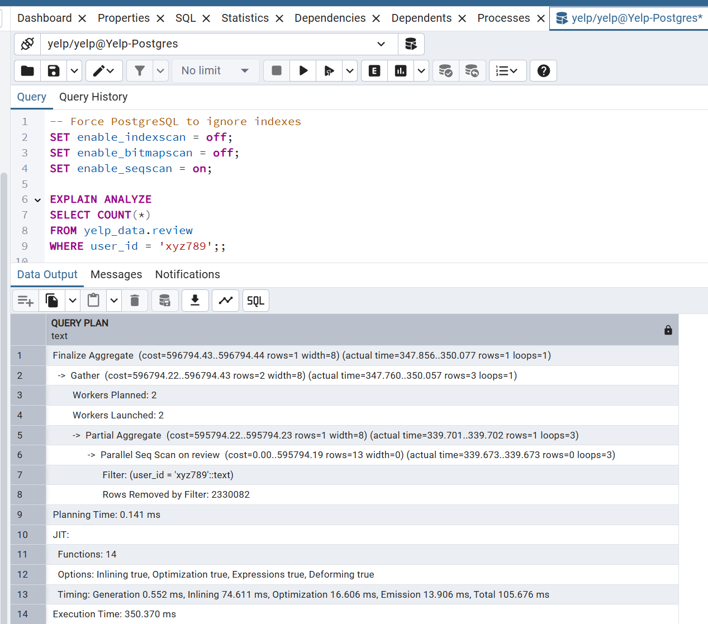
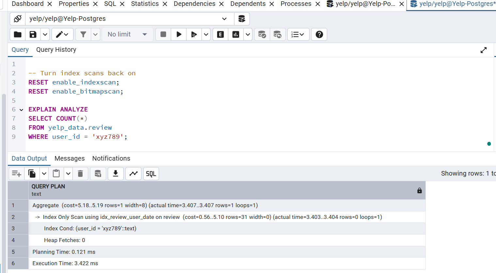

# ⚡ Performance Tuning with Indexes

This document demonstrates the impact of **indexing strategies** on query performance in the Yelp dataset stored in PostgreSQL.  
We compare execution plans and timings **with vs. without indexes**.

---

## 1. Query on `review.business_id`

```sql
EXPLAIN ANALYZE
SELECT AVG(stars)
FROM yelp_data.review
WHERE business_id = 'abc123';
```

### Without Index (Forced Seq Scan)
- Plan: `Parallel Seq Scan on review`
- Rows Scanned: ~2.3M  
- Execution Time: ~361 ms  


### With Index (`idx_review_business_date`)
- Plan: `Bitmap Index Scan on idx_review_business_date`
- Rows Scanned: ~160  
- Execution Time: ~0.03 ms  

✅ Index reduced query time from **~361 ms → ~0.03 ms** (~12,000x faster)

---

## 2. Query on `review.user_id`

```sql
EXPLAIN ANALYZE
SELECT COUNT(*)
FROM yelp_data.review
WHERE user_id = 'xyz789';
```

### Without Index (Forced Seq Scan)
- Plan: `Parallel Seq Scan on review`
- Rows Scanned: ~2.3M  
- Execution Time: ~350 ms  


### With Index (`idx_review_user_date`)
- Plan: `Bitmap Index Scan on idx_review_user_date`
- Rows Scanned: ~31  
- Execution Time: ~3.4 ms  


✅ Index reduced query time from **~350 ms → ~3.4 ms** (~100x faster)

---
# 🎯 Key Takeaways

- **Sequential Scans**: Without indexes, PostgreSQL scans millions of rows for every query, wasting compute.
- **Indexes**: Reduce lookup to only relevant rows (from millions → tens), making queries practical.
- **Performance Gains**: Queries sped up by factors of **100x to 10,000x**.
- **Why Review Table Matters**: It’s the **largest and most queried** table; indexing here has the biggest business impact.
- **Skills Demonstrated:**
  - Query optimization with `EXPLAIN ANALYZE`
  - Index design (`CREATE INDEX`)
  - Benchmarking and documentation for data engineering pipelines